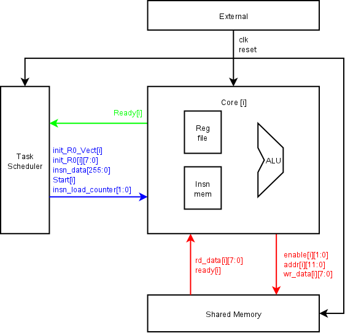
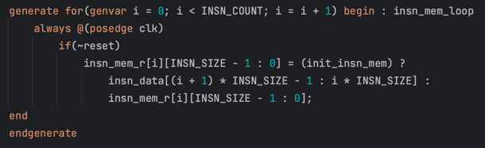

# GPU Core Interface

##### For Core[i]:
###### Core & Task Manager:
1. `Ready[i]` - insn readiness flag. When Ready == 1, Core is waiting.
2. `Start[i]` - flag of beginning reading program and execution. On the next clock cycle after a logical one is established on it (if condition `Ready[i] == 1` is true, else there is block) core reads insn-s (inputs have blue color) and starts execution lowering the flag `Ready[i]`.
3. `init_R0_Vect[i]` - initialisation of register **R0** by the value `init_R0[i][7:0]` flag.
4. `insn_data[255:0]` - code of 16 instructions for execution of 2 bytes each. Decrypted into an array of instructions by the algorithm:

###### Core & Shared Memory
1. `enable[1:0]` - b00 - nothing, b01 - read, b10 - write, b11 - reserved.
2. `addr[11:0]` - address of read/write `{bank_id[3:0], bank_offset[7:0]}`.
3. `wr_data[7:0]` - write data.
4. `rd_data[7:0]` - read data.
5. `ready[i]` - rd/wr execution flag. When `ready[i] == 1` core saves data and continues pipeline cycle.
###### (Pic in Russian)
