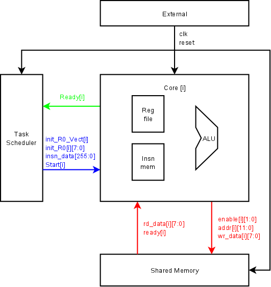
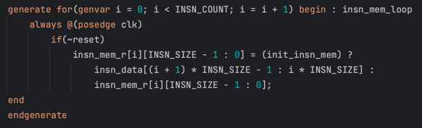

# Интерфейс вычислительного ядра GPU

##### Для i-го ядра:
###### Core & Task Manager:
1. `Ready[i]` - флаг готовности принятия команды по флагу `Start[i]`. Во время его лог. единицы ядро простаивает.
2. `Start[i]` - флаг начала исполнения. На следущем такте после установления лог. единицы на нем (при условии `Ready[i] == 1`, иначе подразумевается блокировка) ядро считывает входные данные (помечены синим цветом) и приступает к исполнению выключая флаг `Ready[i]`.
3. `init_R0_Vect[i]` - флаг установки поданного в `init_R0[i][7:0]` значения в регистр **r0**. Ядро не имеет понятия, сейчас инициализация или нет, поэтому если поданный Instruction Frame не является первым при данном Control Frame, то его зажигать не нужно (Иначе под одним значением инициализация R0 будет сделана несколько раз).  
4. `insn_data[255:0]` - код из 16 инструкций размером по 2 байта для исполнения. Расшифровывается в массив инструкций по алгоритму:

###### Core & Shared Memory
1. `enable[1:0]` - b00 - ничего, b01 - чтение, b10 - запись, b11 - зарезервировано.
2. `addr[11:0]` - `{bank_id[3:0], bank_offset[7:0]}`, те это просто адрес чтения/записи.
3. `wr_data[7:0]` - данные записи.
4. `rd_data[7:0]` - данные чтения.
5. `ready[i]` - флаг выполнения команды чтения/записи (включается на моменте выдачи валидных данных и выключается на следующем за ним такте, но если на следующий такт выданы валидные данные _снова_, то остается включенным (нужно для конвейеризации, у нас могут быть запросы от одного ядра каждый такт)). При `ready[i] == 1` ядро завершает ожидание доступа к памяти и сохраняет полученные данные.

###### Todo
1. Компилятор (на мне)
2. Сигналы валидности. 
3. Узкая шина insn_data.

