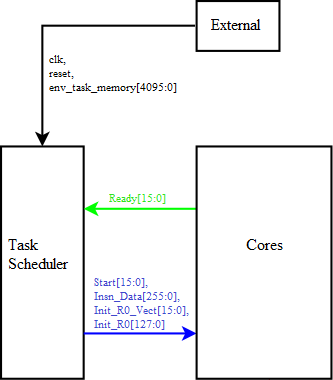

# Task Scheduler

###### Task Scheduler & Ext:
1[input]: `clk`
2[input]: `reset`
3[input]: `env_task_memory[4095:0]` - шина передачи памяти задач в память задач

###### Task Scheduler & Cores:
1[input]: `Ready[15:0]` -  флаг готовности ядер к приёму кадров кода задач (1 - ядро готово, 0 - не готово)
2[output]: `Start[15:0]` - флаг призыва ядер к работе (1 - начинать работу, 0 - простаивать)
3[output]: `Insn_Data[255:0]` - данные кода задач (1 кадр содержит 16 инструкций по 2Б для исполнения)
4[output]: `Init_R0_Vect[15:0]` - флаг инициализации регистра R0 выбранных ядер
5[output]: `Init_R0[127:0]` - данные инициализации регистра R0

